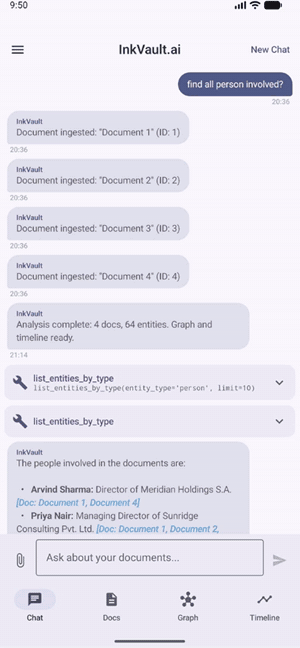

<div align="center">


<br/><br/>

### ⚡ On-Device Investigative Intelligence

**Air-gapped document analysis powered by Gemma 4 LLM**

<br/>



<br/><br/>

[](#)
[](#)
[](#)
[](#)
[](#)
[](#)
[](#)
[](#)

<br/>

> *Built for journalists who can't afford to trust the cloud.*

</div>

<br/>

---

<br/>

## 🔐 Why InkVault?

<table>
<tr>
<td width="80" align="center">

🚫☁️

</td>
<td>

**The Problem** — Investigative journalists face an impossible choice: use powerful AI tools and risk source exposure, or stay offline and lose weeks to manual document analysis.

</td>
</tr>
<tr>
<td align="center">

🛡️📱

</td>
<td>

**The Solution** — InkVault runs the full power of Gemma 4 LLM entirely on your phone. No internet permission. No API keys. No telemetry. Your documents never leave the device sandbox.

</td>
</tr>
</table>

<br/>

---

<br/>

## ✨ Features

<br/>

<details open>
<summary><h3>🔒 Air-Gap Security</h3></summary>

<br/>

| | |
|:--|:--|
| 🚫 | No internet permission in the Android manifest |
| 🧠 | All AI inference runs on-device via LiteRT-LM |
| 📡 | Zero telemetry, analytics, cloud sync, or API calls |
| 🔐 | Documents and entities never leave the app sandbox |
| 🌍 | Designed for hostile environments and source protection |

</details>

<br/>

<details open>
<summary><h3>🤖 Agentic AI — 17 On-Device Tools</h3></summary>

<br/>

The LLM doesn't just chat — it **autonomously decides** which tools to invoke, executes them, and synthesizes findings into clean answers with source citations.

<br/>

<table>
<tr>
<th align="left">🔍 Search & Retrieval</th>
<th align="left">👤 Entity Intelligence</th>
</tr>
<tr>
<td>

- `search_documents` — Full-text + semantic
- `search_document_by_title` — By name or number
- `get_document_stats` — Corpus overview

</td>
<td>

- `extract_entities` — 7 entity types via NER
- `query_entities` — Track across all docs
- `list_entities_by_type` — All people, companies...
- `find_cross_document_entities` — Multi-doc links
- `find_most_frequent_entities` — Ranked

</td>
</tr>
<tr>
<th align="left">⚖️ Forensic Analysis</th>
<th align="left">📊 Synthesis</th>
</tr>
<tr>
<td>

- `find_contradictions` — Two-doc comparison
- `find_all_contradictions` — Corpus-wide scan
- `compare_events` — Chronological ordering
- `query_financial_data` — Money flows
- `scan_for_red_flags` — Suspicious patterns

</td>
<td>

- `summarize_document` — Key findings
- `summarize_corpus` — Full investigation
- `deep_analysis` — Complex reasoning
- `build_timeline` — Event reconstruction

</td>
</tr>
</table>

</details>

<br/>

<details open>
<summary><h3>📷 Dual-Engine OCR Pipeline</h3></summary>

<br/>

```
📸 Camera / Gallery
    │
    ▼
┌─────────────────────────────────────┐
│  Pass 1: ML Kit OCR (~2.5s)        │  ◀── Pixel-level text recognition
│  Pass 2: Gemma 4 Vision            │  ◀── Multimodal cross-reference
│  ✓ Hindi ✓ Urdu ✓ Arabic ✓ 17+    │      for error correction
└─────────────────────────────────────┘
    │
    ▼
  Corrected multilingual text
```

- 🔤 Adaptive preprocessing for faded prints and non-standard layouts
- 🎨 CLAHE contrast enhancement with automatic quality detection
- 🌐 20 languages supported natively

</details>

<br/>

<details open>
<summary><h3>⚙️ Automated Intelligence Pipeline</h3></summary>

<br/>

Every document triggers automatic analysis on ingestion:

```
 📄 Document
  │
  ├──▶ 🔤  OCR extraction
  ├──▶ 🤖  Gemma 4 cross-reference
  ├──▶ 👤  Named entity recognition (7 types)
  ├──▶ 🔗  Relationship extraction (graph edges)
  ├──▶ 📅  Timeline event extraction (ISO-8601)
  ├──▶ 📊  TF-IDF embedding (semantic search)
  └──▶ ⚠️  Contradiction detection vs corpus
```

- ⚡ Combined single-prompt extraction — **3x faster** than sequential calls
- 🔄 Runs on background thread — UI stays responsive

</details>

<br/>

<details open>
<summary><h3>🕸️ Entity Relationship Graph</h3></summary>

<br/>

- 🟦 **Person** · 🟩 **Company** · 🟥 **Shell Entity** · 🟨 **Money** · 🟪 **Date** · 🟫 **Location**
- 🔗 Edge types: `signed_by` · `transacted_with` · `subsidiary_of` · `paid_to` · `located_at`
- 🖐️ Interactive pan/zoom on Compose Canvas
- ⚛️ Fruchterman-Reingold physics simulation

</details>

<br/>

<details open>
<summary><h3>💬 Chat-First Interface</h3></summary>

<br/>

| Feature | |
|:--|:--|
| 🎨 Full-screen chat UI | Like Claude / ChatGPT |
| 📎 Multi-image upload | Batch document ingestion |
| ⚡ Streaming responses | Token-by-token with typing indicator |
| 📝 Markdown rendering | **Bold**, bullets, `[Doc: title]` refs |
| 🔒 Session isolation | Each investigation has its own documents |
| 💾 Persistent history | Chat sessions saved in Room DB |

</details>

<br/>

<details open>
<summary><h3>🔎 Hybrid RAG Search</h3></summary>

<br/>

```
  User Query
      │
      ├──▶  📚 FTS4/FTS5 keyword search  ──────── weight: 40%
      │                                              │
      ├──▶  🧮 TF-IDF cosine similarity  ──────── weight: 60%
      │                                              │
      └──▶  🎯 Weighted merge + Top-K  ◀────────────┘
              │
              ▼
        Grounded context → Gemma 4 → Cited answer
```

</details>

<br/>

<details open>
<summary><h3>🌍 Multilingual Support — 20 Languages</h3></summary>

<br/>

<div align="center">


</div>

</details>

<br/>

---

<br/>

## 🏗️ Architecture

```
                          ╔══════════════════╗
                          ║   InkVault.ai    ║
                          ╚══════════════════╝

  ┌─────────────────────────────────────────────────────────┐
  │  📱 UI          Chat │ Documents │ Graph │ Timeline     │
  │  🧩 ViewModels  ChatVM  DocsVM    GraphVM  TimelineVM   │
  ├─────────────────────────────────────────────────────────┤
  │  🧠 ML Layer                                            │
  │    ┌─ DocumentProcessingPipeline ────────────────────┐  │
  │    │  ImagePreprocessor → MlKitOCR → GemmaVision     │  │
  │    │  NerExtractor (combined) → ContradictionAnalyzer│  │
  │    │  EmbeddingEngine (TF-IDF) → RagPipeline         │  │
  │    │  InvestigationToolSet (17 tools)                 │  │
  │    │  GemmaInferenceEngine + ModelManager             │  │
  │    └─────────────────────────────────────────────────┘  │
  ├─────────────────────────────────────────────────────────┤
  │  💾 Data Layer                                          │
  │    Room DB: 8 entities │ 7 DAOs │ FTS index             │
  │    5 repositories │ TypeConverters                      │
  ├─────────────────────────────────────────────────────────┤
  │  💉 DI: Hilt (AppModule + DatabaseModule)               │
  │  ⚙️ Config: edgeai_config.json → AppConfig              │
  ├─────────────────────────────────────────────────────────┤
  │  🚀 On-Device Inference                                 │
  │    LiteRT-LM 0.10.0 (Gemma 4, 2.4GB, GPU/CPU)         │
  │    ML Kit OCR 16.0.1 (CPU-only, ~10MB)                 │
  └─────────────────────────────────────────────────────────┘
```

<br/>

---

<br/>

## 🛠️ Tech Stack

<br/>

<table>
<tr>
<td align="center" width="96">

<br><sub><b>Kotlin</b></sub>
<br><sub>2.2.10</sub>
</td>
<td align="center" width="96">

<br><sub><b>Compose</b></sub>
<br><sub>Material 3</sub>
</td>
<td align="center" width="96">

<br><sub><b>Android</b></sub>
<br><sub>API 26–35</sub>
</td>
<td align="center" width="96">

<br><sub><b>LiteRT-LM</b></sub>
<br><sub>0.10.0</sub>
</td>
<td align="center" width="96">

<br><sub><b>Room</b></sub>
<br><sub>2.7.1</sub>
</td>
<td align="center" width="96">

<br><sub><b>Hilt</b></sub>
<br><sub>2.56.2</sub>
</td>
</tr>
</table>

<br/>

| | Technology | Details |
|:--|:--|:--|
| 🧠 | **Gemma 4 E2B** | 2.4GB quantized, GPU with CPU fallback |
| 🔤 | **ML Kit OCR** | On-device, CPU-only, 20 languages |
| 🔎 | **Hybrid RAG** | FTS keyword + TF-IDF vector, weighted merge |
| 📷 | **CameraX 1.4.1** | Document capture with live preview |
| 🖼️ | **Coil 3.0.4** | Async image loading |
| ⚡ | **Coroutines + Flow** | Reactive async with mutex-based session management |
| ⚙️ | **JSON Config** | All prompts, tools, thresholds externalized |

<br/>

---

<br/>

## 🚀 Quick Start

```bash
# Clone
git clone https://github.com/rickragv/inkvault.ai.git
cd inkvault.ai

# Build
./gradlew assembleDebug

# Deploy Gemma 4 model
adb push gemma-4-E2B-it.litertlm /sdcard/Download/

# Install & launch
adb install -r app/build/outputs/apk/debug/app-debug.apk
```

<br/>

---

<br/>

## ⚙️ Configuration

> All intelligence parameters live in `edgeai_config.json`
> Zero hardcoded strings in application code.

<br/>

| Section | Controls |
|:--|:--|
| 🧠 `model` | temperature, top_k, top_p, max_tokens |
| 🔧 `tools` | 17 tool definitions with JSON schemas |
| 📝 `prompts` | 9 templates: NER, OCR, analysis, chat |
| 🔎 `rag` | chunk size, overlap, FTS/vector weights |
| ⚙️ `processing` | PDF limits, OCR thresholds, contradictions |
| 🎨 `preprocessing` | CLAHE, binarization, contrast |
| 🌍 `languages` | 20 language codes |
| 💻 `ui` | streaming cursor, graph iterations, date format |

<br/>

---

<br/>

<div align="center">


<br/><br/>

**🔐 Built for journalists who can't afford to trust the cloud.**

<br/>

</div>

---

## License

Proprietary. All rights reserved.
